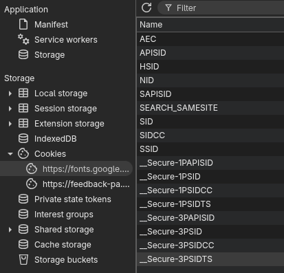
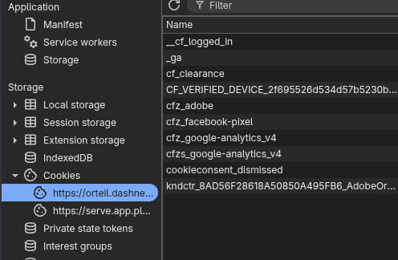

On the first day of security-mas my true love gave to me: a clean cache
with no more cookies!

## Why you should clear your computer cache

In your browser cache, websites can store data for the next time you arrive on
the site. In many cases this is simply convenient, but it opens a vector of
attack to bad actors looking for your data.

### Cookies[^1] are Evil

The cookies websites store in your browser cache are ~~just files~~ data that
needs to be stored by the client (some people [don't like it when you call
them files](https://web.archive.org/web/20251202034136/https://news.ycombinator.com/item?id=40961517)).
One common reason a browser will want
to store cookies for you is to keep you logged in the next time you come to the
site. I consider that to be reasonable, since most times these cookies serve
to store an authentication token for your account and information like your
username. Just make sure you stay on a trusted network because [anyone can
see any data sent over RF communication](https://web.archive.org/web/20251202025513/https://signalsdefense.com/mitigating-electromagnetic-eavesdropping/)
like Wi-Fi.

The websites that don't even have a logon are the websites I find suspicious.
Websites that serve primarily static content have no need to store cookies, and
most times ([though not all the time](https://web.archive.org/web/20251202030351/https://blog.readthedocs.com/ethical-advertising-works/))
these websites are storing trackers and
advertising data. The advertising data often consists of telemetry to 'give you
relevant advertisements', but as stated in the above blog post, it's not
necessary.

One other and less nefarious reason websites store information in cookies is for
performance. ~~Admittedly there are good reasons to do this, but honestly with
the
speed of modern computers, I wonder [if there is even an impact](https://web.archive.org/web/20251202031240/https://www.enzuzo.com/blog/performance-cookies)
~~ Nope, it's actually just marketing cookies.

### Case Study: Google Fonts

I shouldn't need cookies to browse google fonts, but yet they not only put
cookies onto my computer, they say that those cookies are **mandatory**.

You can take a peek at the cookies on any page by using the developer tools in
your browser. Press \<F12\> and navigate to the 'Application' tab, there you
should see the cookies bar. In my particular instance of Google fonts I see
a number of cookies:

<!-- TODO: What do the cookies do? -->

### Case Study: Cookie Clicker

Reasonable use of cookies I would say. It's a game that has no login, but
stores your cookies to save your session with a hash of your data.

But see that pesky Facebook cookie?? Yeah, we don't like that, and what is
adobe doing on my cookie clicker?

## Finding (and Obliterating) the Cookies

In your browser settings, you should look up 'cookies' or 'cache' and then
there should be an option to 'clear all cookies'. You might want to back up
your cookie clicker save before doing so.

## Links

- Look at [pi hole](https://pi-hole.net) to block those advert companies
- Contrary to popular belief, you will not get malware from cookies. This thread
  gives a good overview of [security concerns from cookies](https://web.archive.org/web/20251202034502/https://security.stackexchange.com/questions/107157/what-are-the-risks-of-allowing-the-storage-of-persistent-cookies-on-your-system)
- Should probably add this to my anti-domestic-violence-internet-disappearing
  guide, though if your abusive partner knows how to use cookies to track you,
  you might have to see a professional.

[^1]: As far as I can tell, based on meager search, this term originates with
the
Unix idea of sending a packet of data to another program and receiving exactly
that same data back, often as part of a handshake between those two programs.
You may want to consult [Wikipedia](https://web.archive.org/web/20251202025816/https://en.wikipedia.org/wiki/HTTP_cookie)
and the [jargon book](https://web.archive.org/web/20251202034637/http://www.catb.org/~esr/jargon/html/C/cookie.html)

